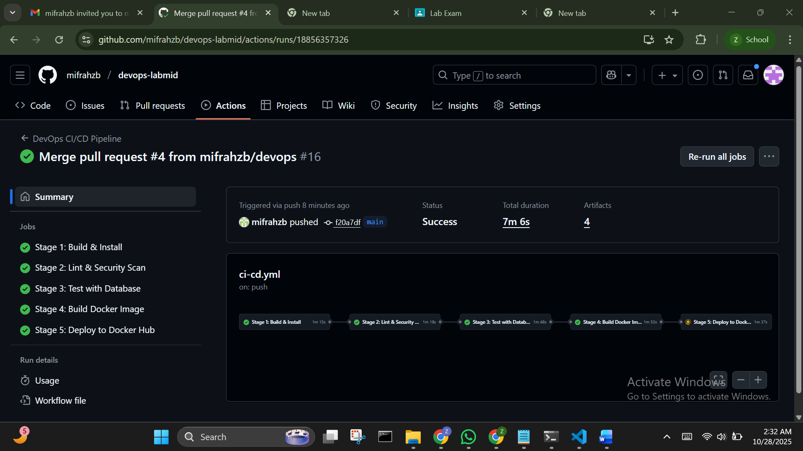
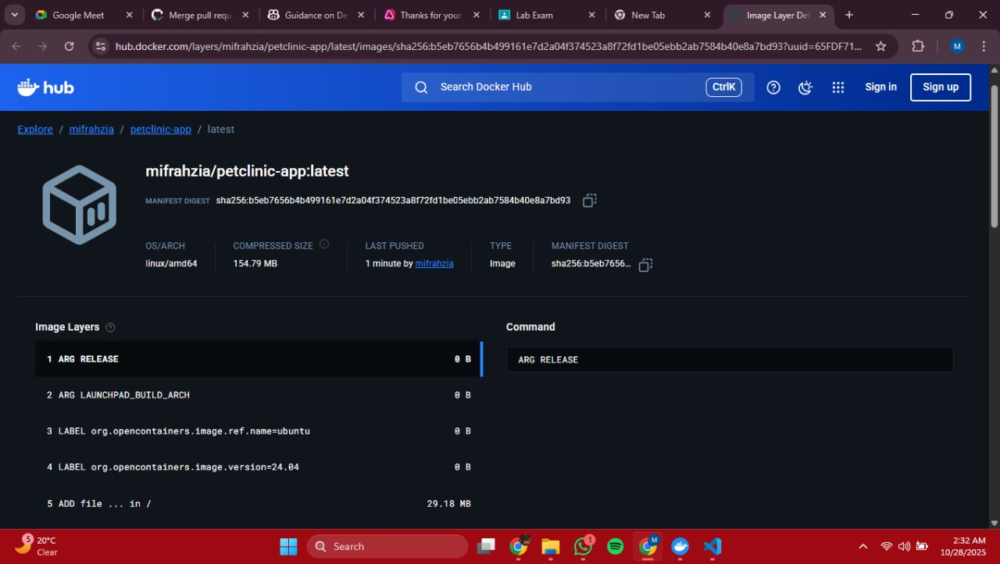

# DevOps Lab Exam Report

## Executive Summary

This report documents the complete DevOps implementation for containerizing and automating the Spring PetClinic application. The project demonstrates a production-grade CI/CD pipeline with PostgreSQL database integration, following DevOps best practices for security, automation, and deployment.

## Technologies Used

### Application Stack
- **Backend Framework:** Spring Boot 4.0.0-M3
- **Java Version:** 21 (Eclipse Temurin)
- **Build Tool:** Maven 3.9.6
- **Frontend:** Thymeleaf Templates
- **Database:** PostgreSQL 15

### DevOps Tools
- **Containerization:** Docker, Docker Compose
- **CI/CD:** GitHub Actions
- **Container Registry:** Docker Hub
- **Secret Management:** GitHub Secrets + Environment Variables
- **Networking:** Docker Bridge Networks

### Pipeline Design

### CI/CD Architecture
┌─────────────────────────────────────────────────────────────┐
│                    GitHub Repository                        │
└───────────────────────────────┬─────────────────────────────┘
                                │
                                ▼
┌─────────────────────────────────────────────────────────────┐
│                   GitHub Actions Trigger                    │
│   on: [push] to [main, devops], [pull_request] to [main]   │
└───────────────────────────────┬─────────────────────────────┘
                                │
                                ▼
┌─────────────────────────────────────────────────────────────┐
│                    Pipeline Stages                          │
│        (with dependencies and services)                     │
├─────────────────┬─────────────────┬─────────────────────────┤
│   Stage 1       │   Stage 2       │   Stage 3               │
│  Build & Install│  Lint & Security│   Test Suite            │
│                 │     Scan        │  + PostgreSQL Service   │
│    (ubuntu)     │    (ubuntu)     │        (ubuntu)         │
├─────────────────┼─────────────────┼─────────────────────────┤
│   Stage 4       │   Stage 5       │                         │
│ Build Docker    │   Deploy        │                         │
│    Image        │  (Conditional)  │                         │
│   (ubuntu)      │    (ubuntu)     │                         │
└─────────────────┴─────────────────┴─────────────────────────┘
        │               │                       │
        └─────needs─────┴─────────needs─────────┘

### Pipeline Stages Details

#### Stage 1: Build & Install
- **Purpose:** Compile source code and resolve dependencies
- **Tools:** Maven
- **Commands:** `mvn clean compile`
- **Output:** Compiled application ready for testing

#### Stage 2: Lint & Security Scan
- **Purpose:** Code quality and vulnerability assessment
- **Tools:** Trivy (vulnerability scanner), SpotBugs (bug detection) **bonus Task**, Checkstyle (code quality)**bonus Task**, Spring Java Format 
- **Checks:** Static code analysis, security vulnerabilities, dependency updates
- **Output:** Security reports, code quality metrics, dependency analysis
- **Note:** Non-blocking scans to allow pipeline progression

#### Stage 3: Test Suite  
- **Purpose:** Automated testing with database integration
- **Tools:** JUnit, Spring Test, PostgreSQL 15 service container
- **Database:** GitHub Actions PostgreSQL service with health checks
- **Test Strategy:** Multi-layered testing (Unit + Integration)
- **Output:** Test results, surefire reports, database connectivity validation

#### Stage 4: Build Docker Image
- **Purpose:** Create optimized container image
- **Tools:** Docker Buildx
- **Features:** Multi-stage build
- **Output:** Docker image 

#### Stage 5: Deploy 
- **Purpose:** Automated deployment to production
- **Conditions:** Tests pass + main branch + not PR
- **Targets:** Docker Hub
- **Credentials:** GitHub Secrets for secure access

## We used a multi-layered testing strategy: 
    - Unit Tests - Basic functionality testing without database - stage 3
    - Postgres integration Tests - Full database testing with PostgreSQL -stage 3
    - Container Testing - Docker image validation -stage 4

## Exam Requirements 
- ✅ **Containerization** with Docker Compose (Multi-service architecture) (time stamped image)

*Proof of multiple containers (app + postgres) running with Docker internal networking*

- ✅ **CI/CD Pipeline** **With bonus task** 5 stages(Build, Test, Security Scan, Docker Build, Deploy) (time stamped images)

*Proof of CI\CD pipeline running*

- ✅ **Secret Management** using environment variables (No hardcoded passwords)
- ✅ **Database Integration** with PostgreSQL and persistent storage
- ✅ **Deployement** Image published on Docker Hub.

*Image in docker hub*

*Image logs*

## Lessons Learnt
We started off with trying to test the application locally but realised there were alot of dependency issues and many versions did not match (example: we had java veriosn 17 installed that wpuld not work). That proved to us the importance of Dockerisation. 

We tried to build containers with Java version 25, which has not yet been released as a stable version. This meant that there was no available image for Java 25. We had to change all dependencies and Dockerfile to Java 21 and build again. Through this, we learned the importance of checking versions before building to avoid issues.

Git branch management was another learning - we initially struggled with moving from the cloned repository to our own repo, but eventually figured out the remote origin changes and branch workflows.

Docker containers ran locally without any issues but raised errors in the CI/CD pipeline. This was becuase the port used in the pipeline for integration testing was the same as the postgres service port in the docker-compose.yml file. This was fixed by changing the port number in the pipeline. 

## Conclusion
All the requirements for the exam have been met and the project has been passed through the pipeline. 
